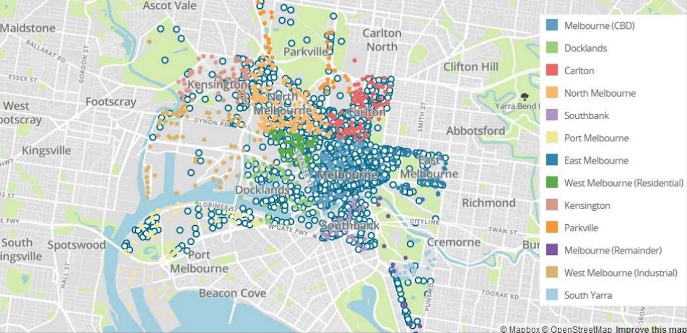

# census-dataset-linkedlist

This C program creates a simple dictionary to store data from the Melbourne Census implemented with a linked list. This was created for Project 1 of COMP20003 (Algorithms and Data Structures) at the University of Melbourne in 2020.

## About this program
A dictionary is an abstract datatype in C that stores and supports lookup of key, value pairs. It has been implemented by storing each key, value pair as a node in a linked list.

Keys can be searched from stdin or a keyfile, and information will be outputted to a specified file.
```dict datafile outputfile``` then type in keys, or
```dict datafile outputfile < keyfile```

## Dataset
The data in this program comes from the City of Melbourne Census of Land Use and Employment (CLUE), accessed from https://data.melbourne.vic.gov.au/Business/Business-establishment-trading-name-and-industry-c/vesm-c7r2.

An example key, value pair in this dictionary:
```In a Rush Espresso −− > Census year: 2018 || Block ID: 44 || Property ID: 105956 || Base propertyID: 105956 || CLUE small area: Melbourne (CBD) || Industry (ANZSIC4) code: 4511 || Industry (ANZSIC4)description: Cafes and Restaurants || x coordinate: 144.96174 || y coordinate: -37.81561 || Location:(-37.81560561, 144.9617411) ||```
